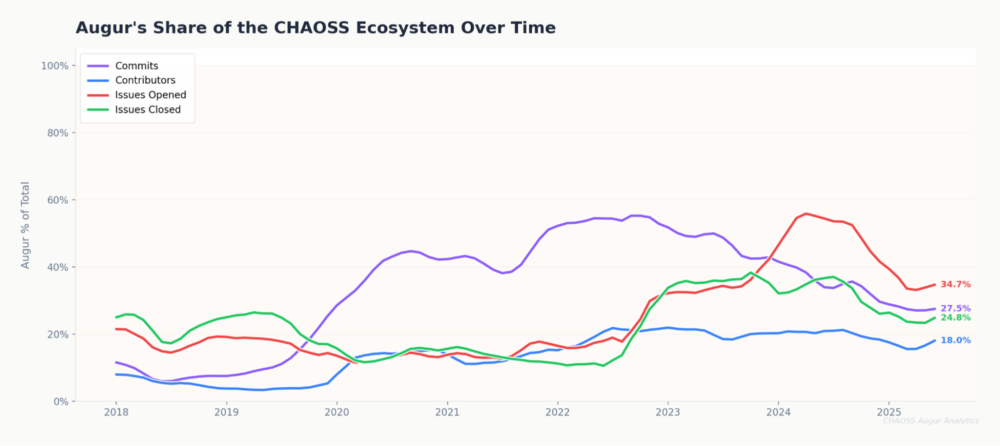
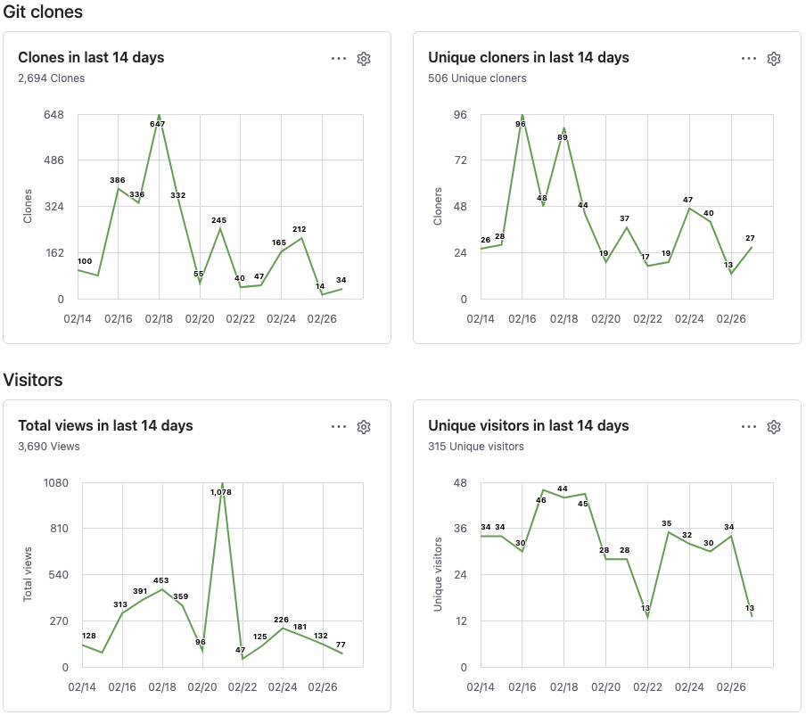
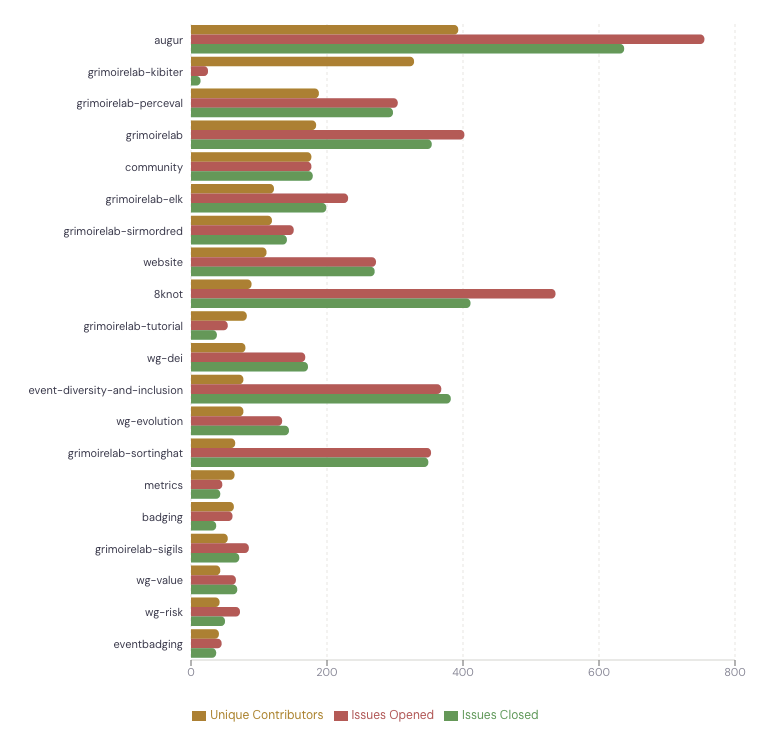

### <span class="c3">Built by CHAOSS Co-Founders to Improve Augur from the Ground Up</span>

<span class="c1">The Aveloxis test project, Augur, was a substantial
component of the CHAOSS ecosystem before governance changes that removed
protections for software creators. These changes were undertaken without
consulting the Augur team that had spent a decade building Augur. A
majority of the board at the time held financial interests in Bitergia,
the primary maintainer of the other CHAOSS software project,
Grimoirelab. The governance changes were undertaken in conjunction with
Bitergia’s bankruptcy, and without consideration of the wider CHAOSS
community or Augur team. </span>

<span class="c1"></span>

<span class="c1">Though we made many attempts to speak with the board and reconcile our concerns, no member of the board spoke with the Augur team. When Augur moved to the CHAOSS github organization the board understood we retained copyright, and could move it back to Augurlabs should governance changes negatively affect the project. </span>

<span class="c1">Augur was a substantial part of the CHAOSS community,
and that success was a big part of CHAOSS’s success. </span>

<span style="overflow: hidden; display: inline-block; margin: 0.00px 0.00px; border: 0.00px solid #000000; transform: rotate(0.00rad) translateZ(0px); -webkit-transform: rotate(0.00rad) translateZ(0px); width: 624.00px; height: 278.67px;"></span>

<span class="c1">By an exponentially wide margin, Augur was the
most-used and most-accessed project in CHAOSS through April of 2026. The
number of clones, unique cloners, and views for Augur dwarfed all other
CHAOSS repositories. Here is a sample for a 14-day period from early
2026. None of these statistics exceeded 100 for any other CHAOSS
repository. </span>

<span class="c1"></span>

<span class="c1">Aveloxis is building on this tradition. </span>

<span class="c1"></span>

<span style="overflow: hidden; display: inline-block; margin: 0.00px 0.00px; border: 0.00px solid #000000; transform: rotate(0.00rad) translateZ(0px); -webkit-transform: rotate(0.00rad) translateZ(0px); width: 624.00px; height: 553.33px;"></span>

<span class="c1"></span>

------------------------------------------------------------------------

<span class="c1"></span>

<span class="c1">Contributions to Augur also drove a substantial portion
of the CHAOSS community. Here is a graph of unique contributors and
issues for the 20 most active CHAOSS repositories, ordered by unique
contributors. Augur was number 1 in terms of the number of issues opened
and closed. </span>

<span style="overflow: hidden; display: inline-block; margin: 0.00px 0.00px; border: 0.00px solid #000000; transform: rotate(0.00rad) translateZ(0px); -webkit-transform: rotate(0.00rad) translateZ(0px); width: 624.00px; height: 601.33px;"></span>

<span class="c1"></span>

------------------------------------------------------------------------

<span class="c1"></span>

<span class="c1"></span>

#### <span class="c7"> Aveloxis builds on this strong tradition with faster, more robust, more fully tested software. </span>


# Aveloxis Documentation

Aveloxis is a high-performance open source community health data collection platform written in Go. It collects data from GitHub and GitLab with equal completeness, storing it in a shared PostgreSQL schema for cross-platform analysis. It is designed as a companion to (and eventual replacement for) the [Augur](https://github.com/chaoss/augur) collection pipeline.

## Key Features

- **Full GitHub + GitLab parity** — same data types collected from both platforms, including MR discussion review comments
- **Staged collection pipeline** — JSONB staging decouples API speed from DB write contention at 400K+ repos
- **Postgres-backed queue** — no Redis, RabbitMQ, or Celery. Multiple instances share the same queue via `SKIP LOCKED`
- **Git commit analysis** — bare clones + `git log --numstat` for per-file commit data, parent tracking, and Facade aggregates
- **Contributor resolution** — resolves git commit emails to GitHub users via noreply parsing, Commits API, and Search API
- **Dependency & complexity analysis** — scans 15 ecosystems, calculates libyear across 12 package registries, runs scc for code complexity
- **Vulnerability scanning** — OSV.dev batch API for CVE/GHSA lookup across all dependencies
- **SBOM generation** — CycloneDX 1.5 + SPDX 2.3 with license capture from 12 registries
- **Interactive visualizations** — weekly time-series charts, cross-project comparison with Z-score normalization, dependency license analysis
- **REST API** — JSON endpoints for stats, time series, licenses, SBOM download, and repo search
- **19 materialized views** — 8Knot-compatible analytics views, rebuilt weekly
- **Dead repo sidelining** — permanently archives 404'd repos while preserving data
- **Deterministic contributor IDs** — Augur-compatible GithubUUID scheme

```{toctree}
:maxdepth: 2
:caption: Getting Started

getting-started/installation
getting-started/configuration
getting-started/quickstart
getting-started/augur-migration
```

```{toctree}
:maxdepth: 2
:caption: User Guide

guide/commands
guide/web-gui
guide/api
guide/visualizations
guide/collection-pipeline
guide/monitoring
guide/ci-cd
guide/scaling
guide/troubleshooting
```

```{toctree}
:maxdepth: 2
:caption: Architecture

architecture/overview
architecture/staged-pipeline
architecture/contributor-resolution
architecture/facade-commits
architecture/analysis
architecture/materialized-views
architecture/column-mapping
architecture/platform-layer
architecture/db-package
```

```{toctree}
:maxdepth: 2
:caption: Reference

schema
```
